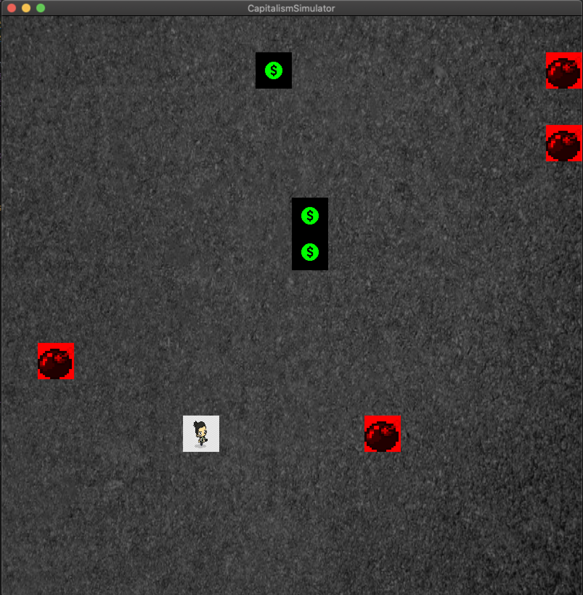

# Final Project

**Author**: Daniel Qian - [danielq3@illinois.edu](mailto:danielq3@illinois.edu)
# Capitalism Simulator

## Game Description

This is a game where the player manuevers around a board where the character collects "money" and avoid 
hitting the bombs. Scores are based off of how many "coins" you collect and also tracks how long you have played.
    
## Getting Started 

### Project Based On
You may have to use CLion on MacOS to build this project. It's possible that you may need to have CMake in order
for it to work.

Get CLion from [JetBrains](https://www.jetbrains.com/clion/).

## Documentation
DEVELOPMENT.md includes my development log throughout the project and PROPOSAL.md includes the plans from before
the project.

## Dependencies
* [cmake](https://cmake.org/)
* [gflags](https://github.com/gflags/gflags)
* [SqliteModernCpp + SQLite](https://github.com/SqliteModernCpp/sqlite_modern_cpp/tree/dev)

## Controls

### Keyboard

Key | Action
--- | ------
w | Move up
a | Move left
s | Move down
d | Move right
r | Reset game
q | Quit game

## Using gflags
Through the edit configurations the flags that can be inputted into Program Arguments:
- **--pace = (Any integer value to change the speed of player)**
- **--name = "(A string that you want to be your name in the leaderboard)"**
- **--size = (Any integer value to change the size of the board)**
- **--tilesize = (Any integer value to change the size of the tiles)**

Separate several flags with a space but not when setting the values

## Outside Sources Used

Free sound effects from [FesliyanStudios](https://www.fesliyanstudios.com)